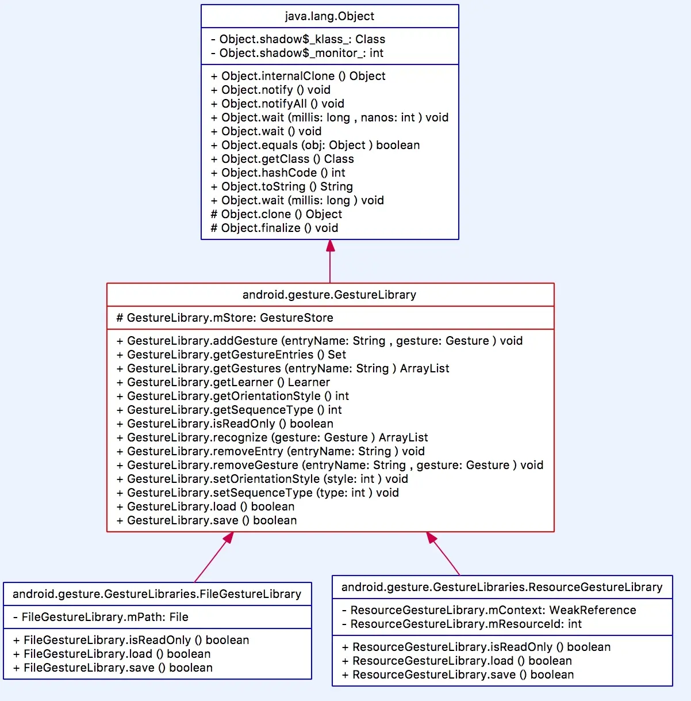

怎么理解一个手势,就是在屏幕上,手画一个符号就是一个手势,它代表了用户的一个意图,也就是用户希望程序做点什么,一般程序大多数是通过按钮,按钮上有对应的文字,这样进行人机交互,而手势也是很多地方会使用到,而常用的手势好像下拉刷新,用户希望列表内容下拉一下就有新的信息,双指缩放等等,一般这些手势都是跟对应的view绑定起来,而今天介绍的都是方法是可以不绑定view,直接在界面上画一个手势就可以人机交互.实现的代码可以在[github上的Demo源码](https://github.com/steven2947/gestureDemo)了解.

这篇手势研究会大概分三部分
1. 手势Gesture使用方式
2. 展示手势开发的步骤及代码实现
3. 分析Gesture的源码及原理

---
<!-- more -->

## 使用的方式

首先我们需要把用户需要使用到的手势提前记录下来,准备一些手势的样本,在app安装时随着资源文件或者下载等方式存储到用户的手机里,当用户在app画一个手势时,就去匹配手势样本,当时样本最吻合时,就知道用户的意图,采取执行对应的功能,这样就是个很好的人机交互的方式.

从上文使用方式,我们大概猜想到,我们需要一个东西,用来管理和读取我们已经存储的手势样本,我们还要需要这个东西可以设别用户的手势跟我们已经存储的手势进行匹配.还有,我们需一个东西在app的界面上记录用户的手势,没错,两个东西都存在,就是GestureLibrary和GestureOverlayView,这两个类就是手势开发里使用的主要两个类,通过这两个类,我们就可以实现手势开发的所有功能,是不是很简单.

总结一下:
1.     提前准备好手势样本,在安装时加入到资源文件或者安装后网络下载.
2.     需要使用手势的界面里使用GestureOverlayView记录用户的手势,
3.     使用GestureLibrary对象对用户的手势进行监听和匹配,找到用户手势的意图,执行对应的功能

---

## 步骤及代码实现

1. 手势库的初始化
    `GestureLibrary gLib=GestureLibraries.fromFile(手势库文件);
 gLib.load();
`
这个过程是读取已经存储手势样本文件,构造出GestureLibrary实例的过程,需要第一步实现.

2. 对用户手势的监听
`GestureOverlayView.addOnGesturePerformedListener()
`

3. 使用GestureLibrary对用户的手势进行匹配
`recognize(Gesture gesture)`
4. 循环遍历返回的ArrayList<Prediction>对象，使用Prediction的score来匹配手势的相似度，
    score越高代表越匹配.
    `Prediction.score()`
    
这里就是手势开发的实现的全部内容,但是作为一个程序猿,需要知其然知其所以然,就要对源码进行解剖.

---

## 原理

### 手势的结构

手势是用户在屏幕上画的符号,那么手势可以简单的一笔笔画,例如一个方向的箭头(>),也可以多笔划,很复杂,例如一个文字.这些都手势,所以我们就知道

> 手势是由一个或者多个笔画组成

学过数学的我们都到线是由点组成的,所以

> 一个手势笔画是由多个时间连续的点组成

一个点意味着什么呢,它会固定在屏幕的某个地方,还需要时间连续不断,所以

> 手势中的点包含坐标X轴和Y轴,还有时间戳

所以我们就很容易了解手势对应的文件了

**GesturePoint** : 是手势笔划中的一个点,包含X轴,Y轴的坐标,还有时间戳.
**GestureStroke** : 手势笔划,可以理解为线,由多个点组成的.
**Gesture** : 手势,代表用户的一个手势,可以由一个或者多个手势笔划组成.
**GestureStore** 手势仓库,里面存储了多个手势样本

---

### 手势的使用

使用手势的过程都是先从GestureLibrary开始,那么看看GestureLibrary的关系图.





从图中看,GestureLibrary的实现有两种,一个File的实现,另外一个是由资源Resource实现,说明我们的手势库可有两个方向可以构造.

然后看回GestureLibrary的源码

```
public abstract class GestureLibrary {
     protected final GestureStore mStore;
     ...
}
```

里面只有一个对象,而所有的方法都是由这个对象实现,也就是GestureLibrary其实是GestureStore的代理类,而真正的功能其实是在GestureStore里.

GestureStore的内容很多,首先看到的是顶部注释里有手势文件的结构内容


|  | Nb.bytes | Java type | Description |
| :-- | :-- | :-- | :-- |
| Header |  |  |  |
|  | 2 bytes | short | File format version |
|  | 4 bytes | int | number Number of entries |
| Entry |  |  |  |
|  | X bytes | UTF String | Entry name |
|  | 4 bytes | int | Number of gestures |
| Gesture |  |  |  |
|  | 8 bytes | long | Gesture ID  |
|  | 4 bytes | int | Number of strokes |
| Stroke |  |  |  |
|  | 4 bytes | int | Number of points |
| Point |  |  |  |
|  | 4 bytes | float | X coordinate of the point |
|  | 4 bytes | float | Ycoordinate of the point |
|  | 8 bytes | long | Time stamp |

从源码可以知道,GestureStore的文件格式主要组成部分,也就是GestureLibrary读取文件的格式内容,也可以考虑根据这样的格式来进行加密,假如用手势来做成一个手写输入法的软件,那么手势库一定是庞大的内容库,而且根据所有人不同的手写方式,这样的手势库一定很有价值,至于怎样加密来保护这些价值,就可以考虑每个手势的内容进行拆分来分别存储和采取不同的加密方式加密.

然后我们再看Store对手势的读取保存

读取和保存

读取第一步GestureLibraries中读取手势文件

```
public boolean load() {
    ...
    mStore.load(new FileInputStream(file), true);
    ...
}
```

第二步store获取文件流

```
public void load(InputStream stream, boolean closeStream) throws IOException {
        DataInputStream in = null;
        try {
            in = new DataInputStream((stream instanceof BufferedInputStream) ? stream :
                    new BufferedInputStream(stream, GestureConstants.IO_BUFFER_SIZE));
            ...

            // Read file format version number
            final short versionNumber = in.readShort();
            switch (versionNumber) {
                case 1:
                    readFormatV1(in);
                    break;
            }
           ...
    }
```
第三步从文件流里读取文件名和手势对象(Gestire),然后存进HashMap里

```
    /**
     * 读取文件数据
     *
     * @param in
     * @throws IOException
     */
    private void readFormatV1(DataInputStream in) throws IOException {
        ...
        for (int i = 0; i < entriesCount; i++) {
            // Entry name
            final String name = in.readUTF();
            // Number of gestures
            final int gestureCount = in.readInt();

            final ArrayList<Gesture> gestures = new ArrayList<Gesture>(gestureCount);
            for (int j = 0; j < gestureCount; j++) {
                final Gesture gesture = Gesture.deserialize(in);
                gestures.add(gesture);
                classifier.addInstance(Instance.createInstance(mSequenceType, mOrientationStyle, gesture, name));
            }

            namedGestures.put(name, gestures);
        }
}


```
读取的方式是从文件流里获取到手势数据,从Gesture的deserialize方法可以知道,每一步的解析都是按照文件存储格式一步步获取数据,当然,存储也是反向一步步保存成文件流格式存储的.


---

#### 手势的匹配

这里我们再好好探求手势的设别匹配,也是我认为手势源码之中最有研究价值的一块.当把代码解析一下就会发现其实很多功能的本质就是数学问题,而这里的手势匹配的本质就是数学的线性代数.

首先从匹配的方法入手,GestureStore.recognize()方法开始看

```
public ArrayList<Prediction> recognize(Gesture gesture) {

        //实例
        Instance instance = Instance.createInstance(mSequenceType, mOrientationStyle, gesture, null);

        //归类
        return mClassifier.classify(mSequenceType, mOrientationStyle, instance.vector);
    }
```

recognize()方法里有两个核心,一个是根据手势对象(Gesture)来构造一个实例,二是通过mClassifier对象的classify()方法来返回一个Prediction数组.

首先从Instance来研究.

```
static Instance createInstance(int sequenceType, int orientationType, Gesture gesture, String label) {
        float[] pts;
        Instance instance;
        if (sequenceType == GestureStore.SEQUENCE_SENSITIVE) {//单笔手势
            //得到一个连续点的数组
            pts = temporalSampler(orientationType, gesture);
            instance = new Instance(gesture.getID(), pts, label);
            instance.normalize();
        } else {
            pts = spatialSampler(gesture);
            instance = new Instance(gesture.getID(), pts, label);
        }
        return instance;
}
```
从Instance的构造方法看是需要三个参数,id,连续点数组,和标签label.所以temporalSampler()和spatialSampler()都是把手势gesture转换为一个数组.

但是为什么需要把一个手势转换为一个数组呢,我们都知道一条线是由无数个点,假如点太多就带来很大量的计算工作,所以我们采用生物学的抽样法.每隔固定的间隔就取一个样本,这样就减少计算量,但是太少的话就会样本集合与真实的差别就很大,所以我们去了一个适合的量作为样本数量.

`    private static final int SEQUENCE_SAMPLE_SIZE = 16;
`

我们取了样本数量为16,把任何一个手势笔划转换为均匀分割的16个点来代替.

转换的方法就是GestureUtils.temporalSampling()


``` 
    /**
     * Samples a stroke temporally into a given number of evenly-distributed
     * points.
     * 代表均匀分布的点的一系列数字作为时间取样的笔划例子
     * 把一个手势的笔划(连续点的线)转化为离散的点
     *
     * @param stroke    the gesture stroke to be sampled
     * @param numPoints the number of points 取样点的数量(越多越精确,越多消耗性能越大)
     * @return the sampled points in the form of [x1, y1, x2, y2, ..., xn, yn]
     */
    public static float[] temporalSampling(GestureStroke stroke, int numPoints) {
        //递增量,手势笔画的长度除以需要切开的段数(离散点数 - 1)
        final float increment = stroke.length / (numPoints - 1);
        //向量长度
        int vectorLength = numPoints * 2;
        //向量
        float[] vector = new float[vectorLength];//因为向量就是取样点的内容,包含x,y坐标,所以是取样点的两倍
        float distanceSoFar = 0;
        float[] pts = stroke.points;
        //上次最新的坐标
        float lstPointX = pts[0];
        float lstPointY = pts[1];
        int index = 0;
        //当前坐标
        float currentPointX = Float.MIN_VALUE;
        float currentPointY = Float.MIN_VALUE;
        vector[index] = lstPointX;
        index++;
        vector[index] = lstPointY;
        index++;
        int i = 0;
        int count = pts.length / 2;
        while (i < count) {
            //默认值,也是第一个运行时执行的
            if (currentPointX == Float.MIN_VALUE) {
                i++;
                if (i >= count) {
                    break;
                }
                currentPointX = pts[i * 2];
                currentPointY = pts[i * 2 + 1];
            }
            //坐标偏移量
            float deltaX = currentPointX - lstPointX;//两个坐标点的X轴差值
            float deltaY = currentPointY - lstPointY;//两个坐标点的Y轴差值
            //deltaX 和 deltaY的平方和的平方根(根据三角函数,)也就是两个点的直线距离
            float distance = (float) Math.hypot(deltaX, deltaY);//根据三角函数定理,X2 + Y2 = Z2

            if (distanceSoFar + distance >= increment) {//当两个点(叠加上次循环的距离)的距离大于递增量(根据numPoints来确定的离散点的间隔距离)时执行
                //比例
                float ratio = (increment - distanceSoFar) / distance;
                float nx = lstPointX + ratio * deltaX;
                float ny = lstPointY + ratio * deltaY;
                vector[index] = nx;
                index++;
                vector[index] = ny;
                index++;
                lstPointX = nx;
                lstPointY = ny;
                distanceSoFar = 0;
            } else {//当两个点的距离少于间隔距离
                //缓存当前的点
                lstPointX = currentPointX;
                lstPointY = currentPointY;
                //当前点默认最小值
                currentPointX = Float.MIN_VALUE;
                currentPointY = Float.MIN_VALUE;
                //叠加记录两点距离
                distanceSoFar += distance;
            }
        }

        //添加剩下最后一个点的坐标
        for (i = index; i < vectorLength; i += 2) {
            vector[i] = lstPointX;
            vector[i + 1] = lstPointY;
        }
        return vector;
    }
```

其中就使用到数学的三角函数公式,通过两个点的坐标(x,y)来计算两点距离.

回到Instance的类

```
    //时间取样
    private static float[] temporalSampler(int orientationType, Gesture gesture) {
        //离散点
        float[] pts = GestureUtils.temporalSampling(gesture.getStrokes().get(0), SEQUENCE_SAMPLE_SIZE);
        //重心点
        float[] center = GestureUtils.computeCentroid(pts);
        //计算弧度值(计算第一个点与重心点形成的角度的弧度值)
        float orientation = (float) Math.atan2(pts[1] - center[1], pts[0] - center[0]);

        //???
        float adjustment = -orientation;
        if (orientationType != GestureStore.ORIENTATION_INVARIANT) {
            int count = ORIENTATIONS.length;
            for (int i = 0; i < count; i++) {
                float delta = ORIENTATIONS[i] - orientation;
                if (Math.abs(delta) < Math.abs(adjustment)) {
                    adjustment = delta;
                }
            }
        }

        //根据中心点平移,平移到中心点在原点上
        GestureUtils.translate(pts, -center[0], -center[1]);
        //根据调整出来的adjustment旋转数据
        GestureUtils.rotate(pts, adjustment);

        return pts;
    }
```

除计算adjustment的方法还没理解透,欢迎读者可以继续跟我交流

这个方法主要计算出手势的间隔点数组,然后平移到坐标原点上和调整角度,输出调整后的数组.就大概完成这个功能内容.接着我们继续看下个功能点classify.

mClassifier这个对象的类似Learner,就是用于实现匹配功能的类,而classify的实现类在InstanceLearner这个类里,那么到底一个这么重要的方法classify到底做了什么呢?

```
    /**
     * 归类
     *
     * @param sequenceType
     * @param orientationType
     * @param vector
     * @return
     */
    @Override
    ArrayList<Prediction> classify(int sequenceType, int orientationType, float[] vector) {

        //预测对象数组
        ArrayList<Prediction> predictions = new ArrayList<Prediction>();
        //实例数组
        ArrayList<Instance> instances = getInstances();

        int count = instances.size();

        //便签找到得分值的map
        TreeMap<String, Double> label2score = new TreeMap<String, Double>();

        for (int i = 0; i < count; i++) {
            Instance sample = instances.get(i);

            //保证数据长度一致
            if (sample.vector.length != vector.length) {
                continue;
            }

            //距离(与手势的差距)
            double distance;
            if (sequenceType == GestureStore.SEQUENCE_SENSITIVE) {
                distance = GestureUtils.minimumCosineDistance(sample.vector, vector, orientationType);
            } else {
                distance = GestureUtils.squaredEuclideanDistance(sample.vector, vector);
            }

            //权重(权重越大,代表越匹配)
            double weight;
            if (distance == 0) {
                //代表完全吻合
                weight = Double.MAX_VALUE;
            } else {
                //取distance的倒数
                weight = 1 / distance;
            }
            Double score = label2score.get(sample.label);
            if (score == null || weight > score) {
                label2score.put(sample.label, weight);
            }
        }

        for (String name : label2score.keySet()) {
            double score = label2score.get(name);
            predictions.add(new Prediction(name, score));
        }

        //排序
        Collections.sort(predictions, sComparator);

        return predictions;
    }
```

这个类主要做的事情就是对用户的手势和所有的已存的手势进行匹配,计算出相识度的权重,然后我们就可以根据这个权重来知道用户的手势大概是什么意思.所以这个方法最重要的内容是计算权重的方法,GestureUtils的minimumCosineDistance()和squaredEuclideanDistance()

```
   /**
     * Calculates the "minimum" cosine distance between two instances.
     * <p>
     * 最小的余弦距离
     *
     * @param vector1
     * @param vector2
     * @param numOrientations the maximum number of orientation allowed
     * @return the distance between the two instances (between 0 and Math.PI)
     */
    static float minimumCosineDistance(float[] vector1, float[] vector2, int numOrientations) {
        final int len = vector1.length;
        //???
        float a = 0;
        float b = 0;
        for (int i = 0; i < len; i += 2) {
            a += vector1[i] * vector2[i] + vector1[i + 1] * vector2[i + 1];//(x1 * x2 + y1 * y2)叠加所有坐标
            b += vector1[i] * vector2[i + 1] - vector1[i + 1] * vector2[i];//(x1 * y2 + y1 * x2)叠加所有坐标
        }
        if (a != 0) {
            final float tan = b / a;
            //角度
            final double angle = Math.atan(tan);
            if (numOrientations > 2 && Math.abs(angle) >= Math.PI / numOrientations) {
                return (float) Math.acos(a);
            } else {
                final double cosine = Math.cos(angle);
                final double sine = cosine * tan;
                return (float) Math.acos(a * cosine + b * sine);
            }
        } else {
            return (float) Math.PI / 2;
        }
    }
```

minimumCosineDistance()方法从注释来说就是实现最小的余弦距离,把用户手势点和一个样本的手势点进行叠加计算,

```
 /**
     * Calculates the squared Euclidean distance between two vectors.
     *
     * @param vector1
     * @param vector2
     * @return the distance
     */
    static float squaredEuclideanDistance(float[] vector1, float[] vector2) {
        float squaredDistance = 0;
        int size = vector1.length;
        for (int i = 0; i < size; i++) {
            //坐标点的x轴或y轴差距
            float difference = vector1[i] - vector2[i];
            squaredDistance += difference * difference;
        }
        return squaredDistance / size;
    }

```

squaredEuclideanDistance 的方法就是计算两点差距,然后平方和再除以数量.

minimumCosineDistance()和squaredEuclideanDistance()的实现是知道,但是为什么要这样计算,和使用哪些数学原理还需继续深究,欢迎读者跟我进行探究.

到这里Gesture的初步研究就差不多了,假如读者需要安卓源码的部分翻译,可以点击[这里](https://github.com/steven2947/AndroidSDKSource)获取.
假如读者需要阅读GestureDemo可以点击[这里](https://github.com/steven2947/gestureDemo),假如读者需要跟我交流[github](https://github.com/steven2947)有邮箱联系方法

## 作者信息
作者:[StevenHe](https://github.com/steven2947)
博客:[简书 - 可乐](https://www.jianshu.com/u/cce7064ee2f6)
工作邮箱:steven2947@163.com

请尊重原创作者,复制引用时保留作者信息


## Promotion

* [七牛云推广链](https://portal.qiniu.com/signup?code=3lh1x8qxlk5le)
* [蓝灯VPN](https://github.com/getlantern/lantern) - 邀请码：YJ3TKYJ