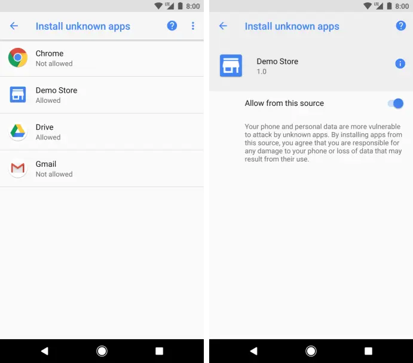
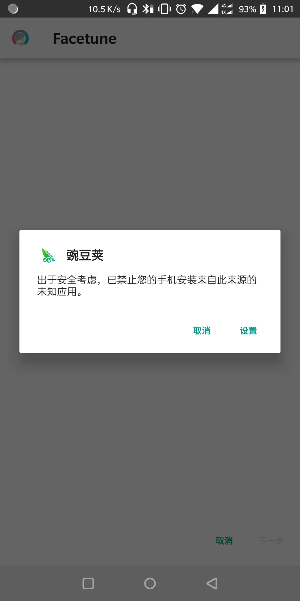
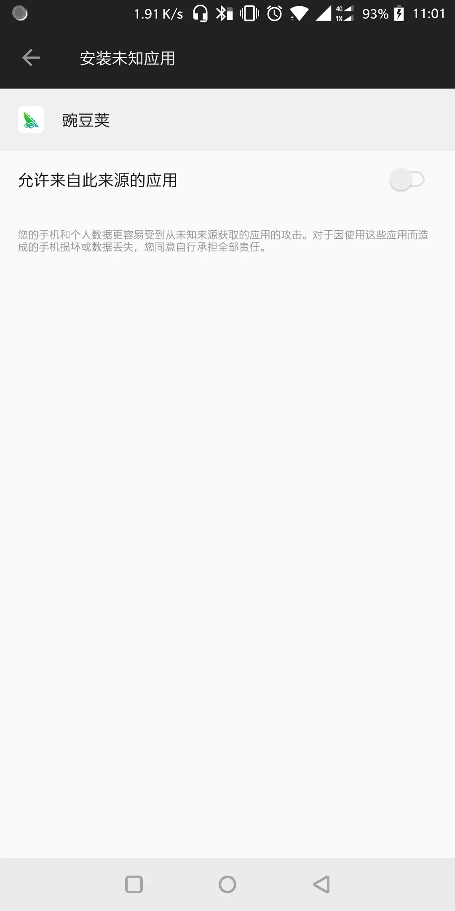

## 前言
以往安装apk都是很简单的方法, Intent 里添加apk的文件就可以调用系统安装界面.后来随着谷歌对安全的重视,从Android 7开始以往的方式都不能用,然而到Android 8 又有改动,相信随着Android 的发展,以后的版本也会有改动,崇尚模块化开发的我便希望每一个细小的功能,颗粒度最少的功能都可以由一个模块来负责,然后每个项目需要这个功能时调用这个模块即可,而这个模块只需要维护好自己的兼容性问题便解决所有项目的兼容性问题.

本文思路是提供一个笔者暂时觉得最优的方案,然后原理分析提供每个Android 版本的安装的原理思路

<!-- more -->

## 最优解决方案 Android Install Apk 库

最优解决方案 :  [FitAndroid8](https://github.com/steven2947/FitAndroid8)

首先笔者在解决Android 7 的安装问题时,遇到系统的私有目录访问限制问题,在解决同时感觉谷歌提供的解决方案特别麻烦,需要项目里因为针对Android 7 而增加一些文件和AndroidManifest 增加一些代码,这非常不合理,到了之后的版本或许又不一样,这些额外的代码都会带来维护的成本,后来搜索很久发现 [FitAndroid7](https://github.com/hongyangAndroid/FitAndroid7) 这个库特别适合,在不用增加自己项目额外的代码同时,解决Android 7 以下的安装问题.然后到Android 8 系统时发现这个库功能失效,所以笔者便在前者的基础上稍微修改,让FitAndroid8能兼容暂时所有版本的安装,一行代码完成一个功能,不引入其他额外与项目无关的代码和文件.

使用方式:
```
public void installApk(View view) {
    File file = new File(Environment.getExternalStorageDirectory(), "app-debug.apk");
    Intent intent = new Intent(Intent.ACTION_VIEW);
    // 仅需改变这一行
    FileProvider8.setIntentDataAndType(this,
            intent, "application/vnd.android.package-archive", file, true);
    startActivity(intent);
}
```


## 原理分析

笔者的习惯是把问题用最简单的方式解决,同时也需要知道其原理,以下内容为原理解析.

### Android 8 如何安装apk

Android 8到时有了什么改变以致安装apk的方法有很大改变呢?

在2017年8月29号的谷歌开发者博客中写道 [<<在 Android O 中更安全地获取应用>>](http://developers.googleblog.cn/2017/08/android-o_29.html)新的安装未知应用的,Android O 禁用了总是安装未知应用的选择,改为安装未知应用时提出设置的提示,减少恶意应用通过虚假的安装界面欺骗用户行为.
所以开发者需要调整AndroidManifest文件里的权限,增加 [REQUEST_INSTALL_PACKAGES](https://developer.android.google.cn/reference/android/Manifest.permission.html#REQUEST_INSTALL_PACKAGES)权限.

```
<uses-permission android:name="android.permission.REQUEST_INSTALL_PACKAGES" />
```

谷歌建议是通过PackageManager [canRequestPackageInstalls()](https://developer.android.google.cn/reference/android/content/pm/PackageManager.html#canRequestPackageInstalls()) 的API，查询此权限的状态,然后使用使用 [ACTION_MANAGE_UNKNOWN_APP_SOURCES](https://developer.android.google.cn/reference/android/provider/Settings.html#ACTION_MANAGE_UNKNOWN_APP_SOURCES) Intent 操作

```
  Intent intent = new Intent(Settings.ACTION_MANAGE_UNKNOWN_APP_SOURCES);
                startActivityForResult(intent, RESULT_CODE);
```

但是笔者不建议这样使用,因为使用 [ACTION_MANAGE_UNKNOWN_APP_SOURCES](https://developer.android.google.cn/reference/android/provider/Settings.html#ACTION_MANAGE_UNKNOWN_APP_SOURCES) Intent 操作后会跳到所有应用列表,然后从众多的应用里选择对应的APP的选择进入再打开权限,这样的用户体验不好.



所以笔者建议不使用判断和Intent跳转.而是直接使用Intent里带apk的安装,会有提示,然后直接进入权限开关的界面,这样的体验相对好,而发现其他的主流的APP安装时也是这样.

流程如下:






### Android 7 如何安装apk

这里谈谈Android 7 安装apk时有什么改变.

参考谷歌文档 [FileProvider](https://developer.android.google.cn/reference/android/support/v4/content/FileProvider) , [Setup-sharing](https://developer.android.com/training/secure-file-sharing/setup-sharing)

从文档里知道,Android 7 开始增加安全性,文件私有化,而需要共享文件给其他程序,例如APK安装程序,需要通过FileProvider配置共享文件,配置表是基于XML文件实现,然后通过Content URI携带配置文件xml来共享文件.

实现配置FileProvider 需要两步:
第一步: 需要配置AndroidManifest.xml清单.

```
<provider  
    android:name="android.support.v4.content.FileProvider"  
    android:authorities="${applicationId}.provider"  
    android:exported="false"  
    android:grantUriPermissions="true">  
    <!-- 元数据 -->  
    <meta-data  
        android:name="android.support.FILE_PROVIDER_PATHS"  
        android:resource="@xml/file_paths" />  
</provider>
```
第二步:建立文件 res/xml/file_paths.xml.

```
<?xml version="1.0" encoding="utf-8"?>  
<resources>  
    <paths>  
        <!--  
        files-path：          该方式提供在应用的内部存储区的文件/子目录的文件。  
                              它对应Context.getFilesDir返回的路径：eg:”/data/data/com.***.***/files”。  
  
        cache-path：          该方式提供在应用的内部存储区的缓存子目录的文件。  
                              它对应Context.getCacheDir返回的路:eg:“/data/data/com.***.***/cache”；  
  
        external-path：       该方式提供在外部存储区域根目录下的文件。  
                              它对应Environment.getExternalStorageDirectory返回的路径

        external-files-path:  Context.getExternalFilesDir(null)

        external-cache-path： Context.getExternalCacheDir(String)
        -->  
        <external-path name="download" path="" />  
    </paths>  
</resources>
```

而其中的 path=""是代表根目录,也就是向共享的应用程序共享根目录以及其子目录的任何一个文件.理论上说假如共享程序是恶意程序,那它便可以获取你的应用的所有共享文件信息.

最后准备好上面两步便可以安装文件

```
/**
  * android7.x
  * @param path 文件路径
  */
  public void startInstallN(Context context, String path) {
      //参数1 上下文, 参数2 在AndroidManifest中的android:authorities值, 参数3  共享的文件  
      Uri apkUri = FileProvider.getUriForFile(context, Constants.AUTHORITY, new File(path));
      Intent install = new Intent(Intent.ACTION_VIEW);
      //由于没有在Activity环境下启动Activity,设置下面的标签 
      install.setFlags(Intent.FLAG_ACTIVITY_NEW_TASK);
      //添加这一句表示对目标应用临时授权该Uri所代表的文件 
      install.addFlags(Intent.FLAG_GRANT_READ_URI_PERMISSION);
      install.setDataAndType(apkUri, "application/vnd.android.package-archive");
      startActivity(install);
  }
```

### Android 6及以下版本 如何安装apk

最后Android 6的安装是简单

```
/**
  *android1.x-6.x
  *@param path 文件的路径
  */
public void startInstall(Context context, String path) {
        Intent install = new Intent(Intent.ACTION_VIEW);
        install.setDataAndType(Uri.parse("file://" + path), "application/vnd.android.package-archive");
        install.addFlags(Intent.FLAG_ACTIVITY_NEW_TASK);
        context.startActivity(install);
    }
```

## 最后

最后简单总结, 特别认同 [FitAndroid7](https://github.com/hongyangAndroid/FitAndroid7) 解决方法的理念.一行代码解决一个基础功能.

## 相关引用

* [FitAndroid7](https://github.com/hongyangAndroid/FitAndroid7)
* [android安装应用(适用于各个版本)](https://www.jianshu.com/p/6b7bd2a59096)
* [在 Android O 中更安全地获取应用](http://developers.googleblog.cn/2017/08/android-o_29.html)
*  [FileProvider](https://developer.android.google.cn/reference/android/support/v4/content/FileProvider) 
*  [Setup-sharing](https://developer.android.com/training/secure-file-sharing/setup-sharing)
