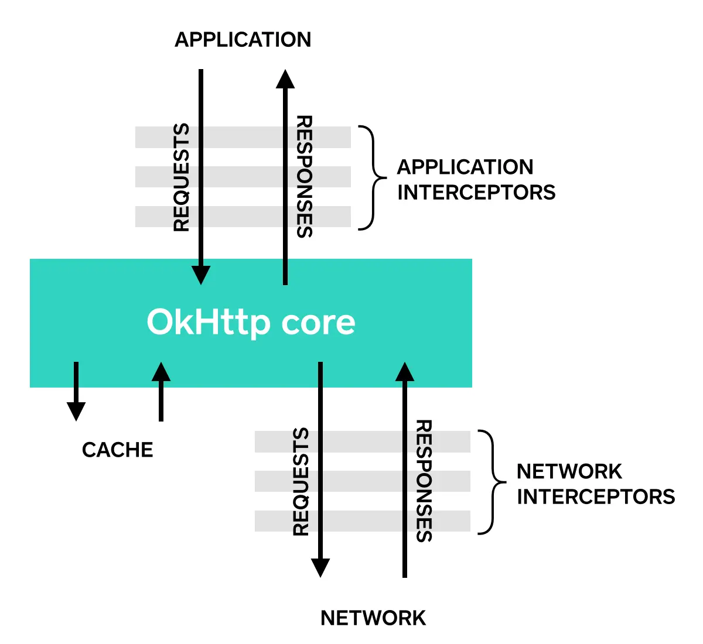

最近工作项目里添加网络缓存时看了这个项目,内容不多,有些方法可取便记录下来

## 原理

[RetrofitCache](https://github.com/yale8848/RetrofitCache) 使用的方式是okhttp原有的cache机制,然后它提供了标签的方式,在Retrofit上简单实现,减少代码入侵,这是这个库的价值.

<!-- more -->

### 添加拦截器

```
okhttp3.OkHttpClient.Builder clientBuilder=new okhttp3.OkHttpClient.Builder();
...
clientBuilder.addInterceptor(new CacheForceInterceptorNoNet());
clientBuilder.addNetworkInterceptor(new CacheInterceptorOnNet());
...
```

首先复习okhttp 的 addInterceptor 和 addNetworkInterceptor 的区别




addInterceptor是添加在与服务器连接之前和之后
addNetworkInterceptor是添加在与服务器建立连接和发起请求的之间

具体参考 [Retrofit2 + OkHttp3 配置及Interceptor原理](http://www.idtkm.com/2017/10/26/Retrofit2%20&%20OkHttp3%20Interceptor/)

#### CacheInterceptorOnNet

CacheInterceptorOnNet是添加在与服务器建立连接和发起请求的之间

获取 maxAge 缓存时间

当需要缓存时

```
 return   response.newBuilder()
                .removeHeader("Cache-Control")
                .header("Cache-Control", "public,max-age="+maxAge)
                .removeHeader("Pragma")
                .build();
```

通过header里面添加 public,max-age=maxAge来缓存,而缓存的实现由 okhttp 里面实现


#### CacheForceInterceptorNoNet

CacheForceInterceptorNoNet类是处理服务器连接之前和之后
功能同理,唯一不同的是在请求之前增加了是否网络连接状态的判断

```
 boolean forceCacheNoNet =  RetrofitCache.getInstance().getCacheTime(url).isForceCacheNoNet();
        if (forceCacheNoNet&&!NetUtils.isConnectNet(RetrofitCache.getInstance().getContext())){
            request = request.newBuilder()
                    .cacheControl(CacheControl.FORCE_CACHE)
                    .build();
        }
```

当没有网络的情况下,通过调用okhttp的Cache-Control来改变状态
具体参考 [Android Okhttp网络请求之缓存控制Cache-Control](http://www.cnblogs.com/whoislcj/p/5537640.html)


#### BaseInterceptor

在bese类里,一个核心的方法是mockResponse,获取在Api里通过标签添加的模拟数据和Asset获取的模拟数据.

而Mock类就是模拟数据的抽象类,而通过RetrofitCache.getInstance().getMockObject(url)获取
使用Java Annotation注解的方式添加

具体参考 [Java Annotation认知(包括框架图、详细介绍、示例说明)](https://www.cnblogs.com/skywang12345/p/3344137.html)


### 总结

这个第三库的本质是使用的okhttp的缓存机制,使用Java Annotation的方法灵活在API里添加注解,以往项目的注解的使用并不多,可以多用这方式提高代码的简洁性,而okhttp的源码也是不熟悉,之后可以详细研究okhttp的源码.

